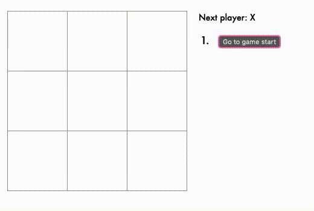

## [1 Day 1 Project](https://github.com/bugxvii/OneDay_OneProject) 

Day 1: Tic Tac Toe

## Description
Create a Tic Tac Toe game.

## Used
- React.js
  + [Create React App](https://github.com/facebook/create-react-app)

## Additional Features
- [x] Display the location for each move in the format (col, row) in the move history list.
- [x] Bold the currently selected item in the move list.
- [x] Rewrite Board to use two loops to make the squares instead of hardcoding them.
- [x] When no one wins, display a message about the result being a draw.

## Reference
- [React Tutorial](https://reactjs.org/tutorial/tutorial.html#picking-a-key)
- [DusanSacha](https://github.com/DusanSacha/react-fb-tutorial)
- StackOverflow
